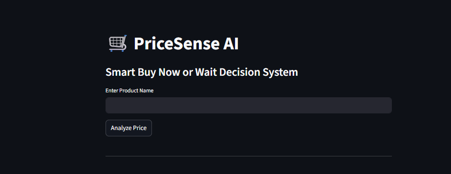
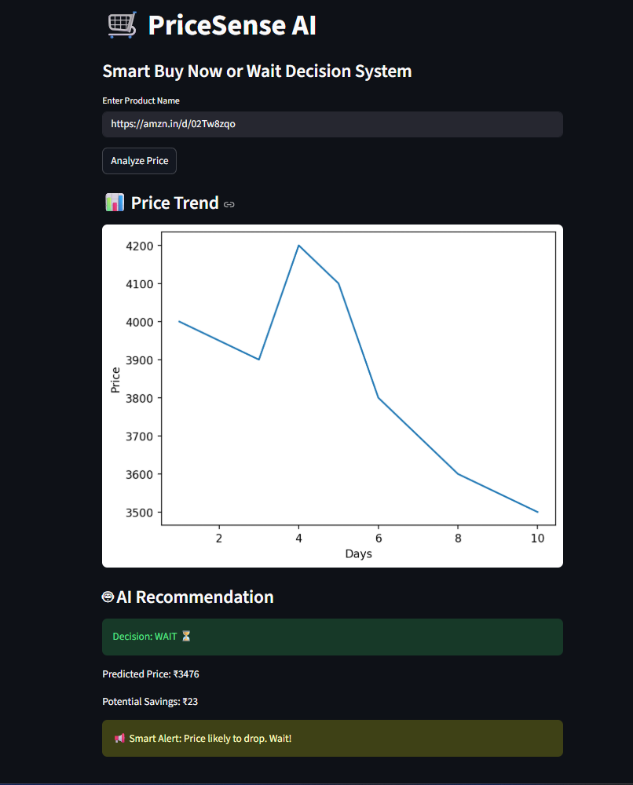

#  PriceSense AI

## Smart Buy Now or Wait Decision System

PriceSense AI is a machine learning based shopping assistant that predicts future product prices and recommends whether users should buy now or wait for a better deal.

## Features

-  Price trend visualization
-  Machine learning based prediction
-  Buy Now / Wait recommendation
-  Potential savings calculation
-  Smart cart optimization
-  Product price scraping

## Tech Stack

- Python
- Streamlit
- Pandas
- NumPy
- Scikit-learn
- Matplotlib
- BeautifulSoup

## Project Structure

PriceSense
 app.py
 scraper.py
 data/
 screenshots/
 requirements.txt

### Page 1

### Page 2

## How to Run

Install dependencies:
pip install -r requirements.txt

Run:
streamlit run app.py

## Author
Pranjal Chougule

